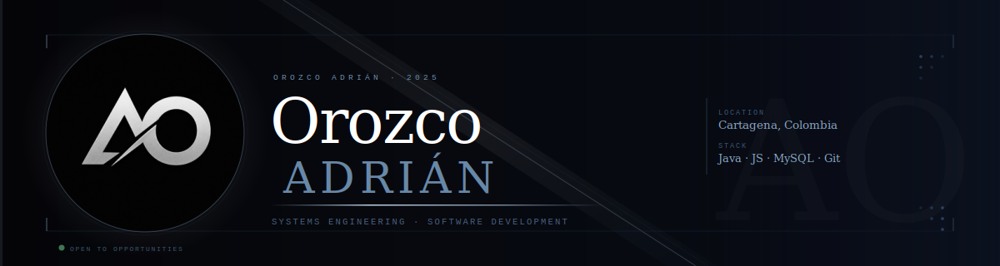

# ABOUT ME

I'm a **Systems Engineering student** focused on **backend development, software architecture, and relational database design**.
I enjoy transforming software requirements into structured, maintainable solutions by combining clean code, technical documentation, and engineering best practices.
Currently, I'm strengthening my knowledge through real-world projects while continuously improving my skills in Java, databases, and software development.
---

# TECH STACK

## Programming Languages & Web Development

-  **Java** *(Logic, Object-Oriented Programming, Data Structures)*

-  **JavaScript (ES6+, DOM & OOP)**

-   **HTML5 & CSS3** *(Structure, Layout and Responsive Design)*
---

## Databases
-  **MySQL** *(Database Design, Queries and Normalization)*

-  **SQLite** *(Local development and lightweight databases)*
---

## Development Tools
-   **Git & GitHub** *(Version Control & Collaboration)*

-  **Visual Studio Code**

-  **MySQL Workbench**

-  **XAMPP**
